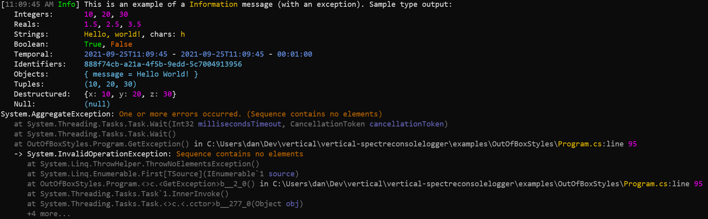
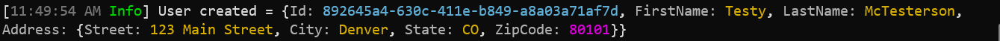
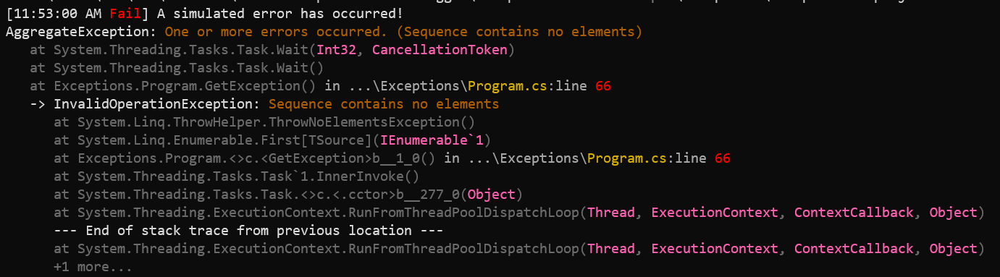

# vertical-spectreconsolelogger

A seriously customizable [Spectre Console](https://spectreconsole.net/) provider for Microsoft.Extensions.Logging.


[](https://github.com/verticalsoftware/vertical-commandline/actions/workflows/dev-build.yml)
[](https://codecov.io/gh/verticalsoftware/vertical-spectreconsolelogger)
[](https://github.com/verticalsoftware/vertical-spectreconsolelogger/actions/workflows/pre-release.yml)
[](https://github.com/verticalsoftware/vertical-spectreconsolelogger/actions/workflows/release.yml)

## Quick Start

Add a package reference to your `.csproj` file:

```
$ dotnet add package vertical-spectreconsolelogger --prerelease
```

Call `AddSpectreConsole` in your logging setup:

```csharp
var loggerFactory = LoggerFactory.Create(builder => builder
    .AddSpectreConsole());

var logger = loggerFactory.CreateLogger("MyLogger");

logger.LogInformation("Hello world!");
```

## Features at a glance

1. Decouples styling and formatting from logging (e.g. don't change your logging, customize how the events are displayed).
2. Define different customizations for _each_ log level.
3. Customize the styling and formatting of specific values or specific types of values.
4. Destructure and output complex types in JSON(ish) notation.
5. Customize the rendering completely using output templates.
6. Extend the logger with your own renderers.

#### Format/style log values



#### Destructured output follows configuration



#### Precisely control exception output



## Documentation

- Introductory Topics
  - [Basic Configuration](docs/basic-configuration.md)
  - [Output Templates](docs/output-template.md)
  - [Formatting Log Values](docs/formatting.md)
  - [Styling Log Values](docs/styling.md)
  - [Destructured Output](docs/destructuring.md)
- Output Renderers
  - [Renderers Overview](docs/renderer-overview.md)
  - [ActivityId](docs/activity-id.md)
  - [CategoryName](docs/category-name.md)
  - [DateTime](docs/date-time.md)
  - [Exception](docs/exceptions.md)
  - [MarginControl](docs/margin-control.md)
  - [NewLine](docs/newline.md)
  - [Scope](docs/scope-value.md)
  - [Scopes](docs/scopes-value)
  - [ThreadId](docs/thread-id.md)
- Advanced Topics
  - [Advanced Configuration](docs/advanced-config.md)

## Examples

Checkout and run our [examples](https://github.com/verticalsoftware/vertical-spectreconsolelogger/tree/dev/examples) to see the logger in action.