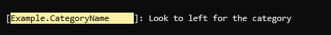

# Category name renderer

### Overview

Renders the category name assigned to the logger when it was created. Typically, this is the full name of a class. Formatting and styling options are defined using the `CategoryNameRenderer.Options` type.

```
Template: {CategoryName[,width][:format]}
```

### Options

> 💡 Note
>
> Renderer names and options within the template are case-sensitive.

|Option|Description|
|---|---|
|`[,width]`|Used to align the output within a fixed width. Negative values align the text to the left; positive values align the text to the right.|
|`[:format]`|The character `S` followed by the number of segments of the category name to be rendered starting with the right-most part. If omitted, the complete category name is rendered.|

Rendering is further controlled by configuring the `CategoryNameRenderer.Options` type that has the following properties:

|Property|Description|
|---|---|
|`Formatter`|A function that receives the category name and returns the string that should be displayed. If not set, the original name is used.|
|`Style`|Markup that is enclosed in a tag and written before the category name is rendered. The tag is closed afterwards.|

### Example

```csharp
var logger = LoggerFactory.Create(builder => builder.AddSpectreConsole(options =>
{
    options.ConfigureProfile(LogLevel.Information, profile =>
        profile
            .OutputTemplate = "{CategoryName,-25:S2}: {Message}")
            .ConfigureRenderer<CategoryNameRenderer.Options>(opt => opt.Style = "black on yellow");           
            
}))
.CreateLogger("Vertical.SpectreConsole.Example.CategoryName");

logger.LogInformation("Look to left for the category");
```

Output:

