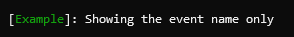

# Event ID renderer

### Overview

Renders the event id assigned to the log event. Formatting and styling options are defined using the `EventIdRenderer.Options` type.

```
Template: {EventId[,width][:format]}
```

### Options

> 💡 Note
>
> Renderer names and options within the template are case-sensitive.

|Option|Description|
|---|---|
|`[,width]`|Used to align the output within a fixed width. Negative values align the text to the left; positive values align the text to the right.|
|`[:format]`|Determines what sub-part of the event id to render. Can be either `Id` or `Name` to render the event id or name, respectively. If omitted, the `.ToString()` value is used.|

Rendering is further controlled by the `EventIdRenderer.Options` type:

|Property|Description|
|---|---|
|`Formatter`|A function that receives the `EventId` value and returns the string representation that should be displayed. If not set, the `.ToString()` value is used.|
|`Style`|Markup that is enclosed in a tag and written before the event id is rendered. The tag is closed afterwards.|


### Example

```csharp
var logger = LoggerFactory.Create(builder => builder.AddSpectreConsole(options =>
    {
        options.ConfigureProfile(LogLevel.Information, profile =>
            profile
                .ConfigureRenderer<EventIdRenderer.Options>(opt => opt.Style = "green")
                .OutputTemplate = "[{EventId:Name}]: {Message}");
    }))
    .CreateLogger("Example");

logger.LogInformation(new EventId(10, "Example"), "Showing the event name only");
```

Output:

