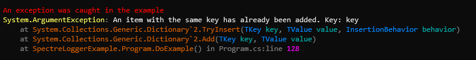

# Exception renderer

### Overview

Renders the exception if set in the current log event. Configuration and styling is controlled by the `ExceptionRenderer.Options` type.

```
Template: {Exception[:NewLine[?]]}
```

|Template Option|Description|
|---|---|
|`[:NewLine]`|Writes a newline character to the output before writing the exception.|
|`[?]`|Writes the new line only if the current insert position within the internal write buffer is not at the current left margin position.|

### Options

The following properties are available on the `ExceptionRenderer.Options` type:

|Property|Description|
|---|---|
|`ExceptionMessageStyle`|The markup used to decorate the exception message.|
|`ExceptionNameFormatter`|A function that receives the exception type and returns the string value to render. If omitted, the full name of the exception is used.|
|`ExceptionNameStyle`|The markup used to decorate the exception name.|
|`MaxStackFrames`|The maximum number of stack frames to output. If omitted, the entire stack trace is shown.|
|`MethodNameFormatter`|A function that receives the method name of a stack frame and returns the string value to render.|
|`MethodNameStyle`|The markup used to decorate the method name of a stack frame.|
|`ParameterNameStyle`|The markup used to decorate a parameter name in a stack frame method.|
|`ParameterTypeStyle`|The markup used to decorate a parameter type in a stack frame method.|
|`RenderParameterNames`|Whether to render parameter names of a stack frame method.|
|`RenderParameterTypes`|Whether to render parameter types of a stack frame method.|
|`RenderSourceLineNumbers`|Whether to render source line numbers of a stack frame method.|
|`RenderSourcePaths`|Whether to include source paths in the output of a stack frame.|
|`ShowHiddenStackFrameCount`|Whether to show the number of stack frames that weren't shown.|
|`SourceLineNumberStyle`|The markup used to decorate the line number of a method of a stack frame.|
|`SourcePathFormatter`|A function that receives the path of a source file in a stack frame, and returns the string value to render.|
|`SourcePathStyle`|The markup used to decorate source paths of a stack frame.|
|`StackFrameIndentChars`|The number of characters to indent on each new stack frame line.|
|`StackFrameStyle`|The markup used to decorate a stack frame.|
|`UnwindAggregateExceptions`|Iterates and displays all exceptions in an `AggregateException`.|
|`UnwindInnerExceptions`|Recursively displays all inner exceptions.|

### Example

```csharp
var logger = LoggerFactory.Create(builder => builder.AddSpectreConsole(options =>
    {
        options.ConfigureProfiles(profile =>
        {
            profile.OutputTemplate = "{Message}{Exception:NewLine?}";
            profile.ConfigureRenderer<ExceptionRenderer.Options>(exOptions =>
            {
                exOptions.ExceptionMessageStyle = Color.Grey93.ToMarkup();
                exOptions.ExceptionNameFormatter = type => type.FullName!;
                exOptions.ExceptionNameStyle = Color.LightGoldenrod1.ToMarkup();
                exOptions.SourceLineNumberStyle = Color.Magenta1.ToMarkup(); 
                exOptions.MaxStackFrames = 5;
                exOptions.MethodNameStyle = Color.DarkOrange3_1.ToMarkup();
                exOptions.ParameterNameStyle = Color.LightSeaGreen.ToMarkup();
                exOptions.ParameterTypeStyle = Color.DodgerBlue1.ToMarkup();
                exOptions.RenderParameterNames = true;
                exOptions.RenderSourceLineNumbers = true;
                exOptions.RenderParameterTypes = true;
                exOptions.RenderSourcePaths = true;
                exOptions.SourcePathFormatter = Path.GetFileName;
                exOptions.SourcePathStyle = Color.Grey50.ToMarkup();
                exOptions.StackFrameStyle = Color.Grey50.ToMarkup();
                exOptions.UnwindAggregateExceptions = true;
                exOptions.UnwindInnerExceptions = true;
            });
        });
    }))
    .CreateLogger("Vertical.SpectreLogger.Console.Example");

try
{
    new Dictionary<string, string> {["key"] = string.Empty}.Add("key", string.Empty);
}
catch (Exception exception)
{
    logger.LogError(exception, "An exception was caught in the example");
}
```


