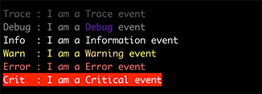
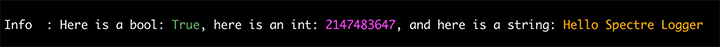
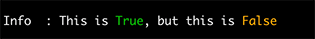
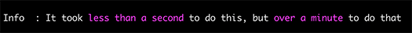

# Formatting profiles

## Overview

Formatting profiles control precisely how events are rendered _for a specific_ log level. This means that events can appear differently depending on their severity. Formatting profiles are configured within logging setup using delegates. Out-of-box, calling `AddSpectreConsole()` will configure default formatting profiles using a basic set of styles and formatting. Any changes made to the profile overwrite the default configuration.

Profiles are configured by setting properties or using extension methods on the `FormattingProfile` type. Configuration settings and customization can be applied to a single profile using `ConfigureProfile`, or to multiple profiles using `ConfigureProfiles`.

```csharp
var loggerFactory = LoggerFactory.Create(builder => 
{
    builder.AddSpectreConsole(options => 
    {
        // Apply configuration to a single event level:
        options.ConfigureProfile(LogLevel.Debug, profile => 
        {
            // configuration
        });    
        
        // Apply configuration to multiple event levels:
        options.ConfigureProfiles(new[]{LogLevel.Trace, LogLevel.Debug}, profile =>
        {
            // configuration
        });
        
        // Apply configuration to all events of all log levels:
        options.ConfigureProfiles(profile =>
        {
            // configuration
        });
    };
});
```

## Property summary

Below is a summary of the properties of the `FormattingProfile` type:

|Property|Description|
|---|---|
|LogLevel|(Read-only) - gets the log level the formatting profile is controlling.|
|OutputTemplate|Controls the structure of each rendered event.|
|BaseEventStyle|The markup to apply before rendering the event.|
|TypeStyles|Controls the markup that is applied to values of specific types.|
|DefaultTypeStyle|Controls the markup that is applied to values when a specific style is not found in `TypeStyles` for a type.|
|TypeFormatters|Functions that provide the string representation of a specific type for rendering.|
|DefaultTypeFormatter|A function that provides a string represents of values for rendering when the type is not found in `TypeFormatters`.
|ValueStyles|Controls the markup that is applied to specific values.|

## Styling overview

> 💡 Note
>
> Any 'Style' property is simply a string with valid Spectre Console markup (e.g. "red1", "white on red1", etc.). It is not necessary to enclose markup in square brackets because the logger implementation does that for you. Furthermore, style tags are automatically closed when their scope ends.
>
> Square brackets that are found in other string properties of options objects are escaped.

Rendering components in the logging implementation use Spectre Console markup strings to decorate the text being rendered. String values found in the various `*Style` properties are enclosed in square brackets and written to the output buffer. The text being decorated is then written to the buffer, and finally the proper closing tag ([/]) is written.

Markup styling can be applied to many distinct parts of the logging event and is detailed in the sections below.

## Property detail

> 💡 Note
>
> The examples below have been shortened for brevity. Assume the `profile` variable is a `FormattingProfile` instance.

### The output template

The `OutputTemplate` property is a string that controls the structure of each log event. It contains an ordered series of placeholders enclosed in curly braces (handlebars) and other static text. During event rendering, the placeholders are replaced with the output of the specific renderer. Other static text that does not map to a renderer is copied verbatim to the output in the exact order it is found in the string. Here is a simple example:

```csharp
// Configuring the template
profile.OutputTemplate = "[{LogLevel}/{CategoryName}]: {Message}";

// Elsewhere...
logger.LogInformation("Hello Spectre logger");
```


In addition to several [out-of-box renderers](renderers.md), applications can easily extend the logger with their own [custom renderer](custom-renderer.md) implementations.

### Base event style

The `BaseEventStyle` property is a markup tag that is written before the output template is rendered and closed at the completion of the event. This is the markup the event will fall back to when no other styling is introduced.

```csharp
// Configuring the styles
options
        .ConfigureProfile(LogLevel.Debug, profile => profile.BaseEventStyle = "grey54")
        .ConfigureProfile(LogLevel.Information, profile => profile.BaseEventStyle = "grey93")
        .ConfigureProfile(LogLevel.Warning, profile => profile.BaseEventStyle = "yellow")
        .ConfigureProfile(LogLevel.Error, profile => profile.BaseEventStyle = "red")
        .ConfigureProfile(LogLevel.Critical, profile => profile.BaseEventStyle = "white on red")
        .MinimumLevel = LogLevel.Trace

// Elsewhere...
logger.LogTrace("I am a {level} event", LogLevel.Trace);
logger.LogDebug("I am a {level} event", LogLevel.Debug);
logger.LogInformation("I am a {level} event", LogLevel.Information);
logger.LogWarning("I am a {level} event", LogLevel.Warning);
logger.LogError("I am a {level} event", LogLevel.Error);
logger.LogCritical("I am a {level} event", LogLevel.Critical);
```



### Styling Types

The `TypeStyles` dictionary and the `DefaultTypeStyle` property control how values of specific types are decorated when they are rendered within a log message. `TypeStyles` is a dictionary of markup strings keyed by `Type`. The `MessageTemplateRenderer` will use the markup it matches to the value's type, otherwise it will fallback to the `DefaultTypeStyle` value (if set).

> 💡 Note
> 
> The `AddTypeStyle` family of methods can be used instead of interacting directly with the `TypeStyles` dictionary.

```csharp
// Configuring the styles
options.ConfigureProfiles(profile => profile      
    .ClearTypeStyles()                            
    .AddTypeStyle<int>(Color.Magenta1.ToMarkup()) 
    .AddTypeStyle<bool>(Color.Green.ToMarkup())   
    .DefaultTypeStyle = Color.Orange1.ToMarkup());
    
// Elsewhere... the string will use the DefaultTypeStyle value
logger.LogInformation("Here is a bool: {bool}, here is an int: {int}, and here is a string: {string}",
    true,
    int.MaxValue,
    "Hello Spectre Logger"); 
```



### Styling null values

Since `null` doesn't have a `Type` that can be discerned, the library defines the special pseudo-type `NullValue`. You can register a style against this type to decorate null values.

### Styling specific non-null values

The `ValueStyles` dictionary controls how specific values are rendered within a log message. For instance, you may want to call attention to `false` boolean values in your output.

> 💡 Note
>
> The `AddValueStyle` family of methods can be used instead of interacting directly with the `ValueStyles` dictionary.

```csharp
// Configure the value styles
options.ConfigureProfiles(profile => profile
    .ClearValueStyles()
    .AddValueStyle(true, Color.Green.ToMarkup())
    .AddValueStyle(false, Color.Orange1.ToMarkup()));

// Elsewhere
logger.LogInformation("This is {true}, but this is {false}", true, false);
```



### Formatting log values

Every log value that is output by the `MessageTemplateRenderer` can be transformed to different representations. There are two ways to do this:

1. Use .Net composite formatting in the message template field (discussed in the [message template](link) renderer documentation).
2. Use a type formatting function

The `TypeFormatters` dictionary and the `DefaultTypeFormatter` property control how value types are transformed for output. The function is a simple delegate `Func<object?, string?>` where the value is passed and a string is returned. The string is what is rendered in the output. Use a formatting function when there is no composite formatting option. Formatting falls back to the `DefaultTypeFormatter` if a specific type is not found.

```csharp
// Configure the formatter
options.ConfigureProfiles(profile => profile
    .AddTypeFormatter<int>(i => i < 1000 
        ? "less than a second" 
        : i < 60000 
            ? "less than a minute" 
            : "over a minute"));

// Elsewhere...
logger.LogInformation("It took {fast} to do this, but {slow} to do that", 
    500,
    60000);
```

