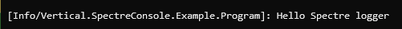
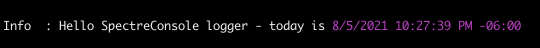

# Formatting profiles

## Overview

Formatting profiles control precisely how events are rendered _for a specific_ log level. This means that events can appear totally different depending on their severity. Formatting profiles are configured within logging setup using delegates. Out-of-box, calling `AddSpectreConsole()` will configure default formatting profiles using a basic set of styles and formatting. Any changes made to the profile overwrite the default configuration.

Profiles are configured by setting properties or using extension methods on the `FormattingProfile` type. Configuration settings and customization can be applied to a single profile using `ConfigureProfile`, or to multiple profiles using `ConfigureProfiles`.

```csharp
var loggerFactory = LoggerFactory.Create(builder => 
{
    builder.AddSpectreConsole(options => 
    {
        // Apply configuration to a single event level:
        options.ConfigureProfile(LogLevel.Debug, profile => 
        {
            // configuration
        });    
        
        // Apply configuration to multiple event levels:
        options.ConfigureProfiles(new[]{LogLevel.Trace, LogLevel.Debug}, profile =>
        {
            // configuration
        });
        
        // Apply configuration to all events of all log levels:
        options.ConfigureProfiles(profile =>
        {
            // configuration
        });
    };
});
```

## Property summary

|Property|Description|
|---|---|
|LogLevel|(Read-only) - gets the log level the formatting profile is controlling.|
|OutputTemplate|Controls the structure of each rendered event.|
|BaseEventStyle|The markup to apply before rendering the event.|
|TypeStyles|Controls the markup that is applied to values of specific types.|
|DefaultTypeStyle|Controls the markup that is applied to values when a specific style is not found in `TypeStyles` for a type.|
|TypeFormatters|Functions that provide the string representation of a specific type for rendering.|
|DefaultTypeFormatter|A function that provides a string represents of values for rendering when the type is not found in `TypeFormatters`.
|ValueStyles|Controls the markup that is applied to specific values.|

## Property detail

> 💡 Note
> 
> In all of the examples below, for brevity the `options` variable is an instance of the `SpectreLoggerOptions` class. This class type is what is provided to the delegate in the `AddSpectreConsole()` method.

### OutputTemplate

An output template is simply a string with field names enclosed in handlebars. For example, consider the following template string:

```
[{LogLevel}/{CategoryName}]: {Message}{Exception:NewLine}
```

This instructs the logger to render the log level in brackets, a colon, the message, and the exception (if present) on a new line similar to what is illustrated below:



Each field name between handlebars in the output template corresponds to a specific rendering component. See [built-in renderers](renderers.md) for more detailed explanations on each renderer type.

### BaseEventStyle

When set, this string is formatted as a Spectre Console markup string (enclosed in brackets) and written to the buffer before the template is rendered. After the template is rendered the closing tag is written. This value can be used to establish the default style of the event text.

### TypeStyles

`TypeStyles` is a dictionary of markup style strings that are associated to a `Type`. Before the `MessageTemplateRenderer` writes a substituted log value found in a structured log message, it obtains the type of the value and performs a lookup in this dictionary. If the entry exists, the value is written to the buffer as Spectre Console markup, the log value is written, and the markup tag is closed. If the type key is not found, the value is written without any markup.

The easiest way to set markup for a specific type is to use one of the `AddTypeStyle` extension methods. For example:

```csharp
// The following example will render all DateTimeOffset values in purple for all log level events.
var loggerFactory = LoggerFactory.Create(builder =>
{
    builder.AddSpectreConsole(options =>
    {
        options.ConfigureProfiles(profile =>
        {
            profile.AddTypeStyle<DateTimeOffset>(Color.Purple.ToMarkup());
        });
    });
});

var logger = loggerFactory.CreateLogger("Program");

logger.LogInformation("Hello Spectre logger - today is {Date}", DateTimeOffset.Now);
```

