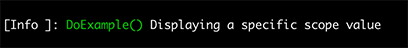

# Keyed Property Value renderer

### Overview

Renders a single keyed property value using optional width and formatting.

```
Template: {Property:<key>[,width][:format]}
```

### Options

> 💡 Note
>
> Renderer names and options within the template are case-sensitive.

|Template Option|Description|
|---|---|
|`<key>`|The key of the scope property to render. The renderer will match this value on a property in the log event, or with a key on the following scope types: `KeyValuePair<string, object>`, a `ValueTuple<string, object>`, `Tuple<string, object>`, or in one of the elements found in an `IEnumerable<T>` collection of any of these types.|
|`[,width]`|Used to align the output within a fixed width. Negative values align the text to the left; positive values align the text to the right.|
|`[:format]`|A composite formatting code supported by `string.Format` and the value type.

Rendering is further controlled by the `KeyedPropertyValueRenderer.Options` type. The following properties are available:

|Property|Description|
|---|---|
|`TypeStyles`|A dictionary of markup styles that are associated to specific types. The renderer evaluates the type of value being rendered and looks for a style in this dictionary. If found, the markup is applied before the value is rendered and the tag is closed afterward.|
|`DefaultTypeStyle`|A single markup style used as a fallback for all values rendered whose types are not located in the `TypeSyles` dictionary.|
|`ValueStyles`|A dictionary of markup styles that are associated to specific values. The renderer evaluates the value being rendered and looks for a style in this dictionary. If found, the markup is applied before the value is rendered and the tag is closed afterward.|
|`TypeFormatters`|A dictionary of formatting functions that are associated to specific types. The renderer evaluates the type of value being rendered and looks for a formatting function in this dictionary. If found, the function provides the value to render.
|`DefaultTypeFormatter`|A formatting function used as a fallback for all values rendered whose types are not located in the `TypeFormatters` dictionary.

Instead of accessing the dictionaries directly, alternatively use the extension methods on the `FormattedLogValuesRenderer.Options` types to set formatters and styles as shown below:

|Extension Method|Description|
|---|---|
|`AddTypeFormatter(Type, Func<>)`|Adds a formatting function for the given type|
|`AddTypeFormatter(IEnumerable<Type>, Func<>)`|Adds a formatting function for the given types|
|`AddTypeFormatter<T>(Func<>)`|Adds a formatting function for the type identified by the generic parameter|
|`AddTypeStyle(Type, string)`|Adds a style for the given type|
|`AddTypeStyle(IEnumerable<Type>, string)`|Adds a style for the given types|
|`AddTypestyle<T>(string)`|Adds a style for the type identified by the generic parameter|
|`AddValueStyle<T>(T, string)`|Adds a style for a specific value|
|`AddValueStyle(IEnumerable<object>, string)`|Adds a style for the given specific values|
|`ClearTypeFormatters()`|Clears all type formatters|
|`ClearTypeStyles()`|Clears all type styles|
|`ClearValueStyles()`|Clears all value styles|


### Example

In the following example, a scope is started that contains a key/value pair. It is then mapped in the output template.

```csharp
var logger = LoggerFactory.Create(builder => builder.AddSpectreConsole(options =>
{
    options.ConfigureProfiles(profile =>
    {
        profile.OutputTemplate = "[{LogLevel,-5}]: {Property:MethodName} {Message}";
        profile.ConfigureRenderer<ScopeValueRenderer.Options>(renderer =>
        {
            renderer.ClearTypeStyles();
            renderer.DefaultTypeStyle = Color.Green.ToMarkup();
            renderer.DefaultTypeFormatter = method => $"{method}()";
        }); 
    });
}))
.CreateLogger("Example");

using var scope = logger.BeginScope(new KeyValuePair<string, object>("MethodName", nameof(DoExample)));

logger.LogInformation("Displaying a specific scope value");
```

Output:


