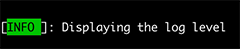

# Log Level renderer

### Overview

Renders the log level of the event.

```
Template: {LogLevel[,width]}
```

|Option|Description|
|---|---|
|`[,width]`|Used to align the output within a fixed width. Negative values align the text to the left; positive values align the text to the right.|

Rendering is further controlled by the `LogLevelRenderer.Options` type:

|Property|Description|
|---|---|
|`Formatter`|A function that receives a `LogLevel` value and returns the string representation that should be displayed. If not set, the `.ToString()` value is used. Defaults display names are configured when calling `AddSpectreConsole()`.|
|`Style`|Markup that is written before the log level is rendered and closed afterwards.|

### Example

```csharp
var logger = LoggerFactory.Create(builder => builder.AddSpectreConsole(options =>
    {
        options.ConfigureProfile(LogLevel.Information, profile =>
        {
            profile.OutputTemplate = "[{LogLevel,-5}]: {Message}";
            profile.ConfigureRenderer<LogLevelRenderer.Options>(opt =>
            {
                opt.Formatter = _ => "INFO";
                opt.Style = "black on green";
            });
        });
    }))
    .CreateLogger("Example");

logger.LogInformation("Displaying the log level");
```

