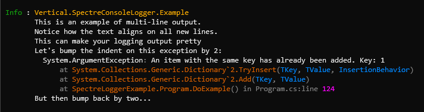

# Margin control

### Overview

Adjusts the margin that is applied when the logger encounters newline characters.

```
Template: {Margin:<offset>}
```

### Options

|Template Options|Description|
|---|---|
|`<offset>`|A positive or negative integer by which the current margin is offset.|

### Remarks

This renderer does not output anything, but it does control the virtual margin of the write buffer. Anytime the write buffer encounters the new line character `\n`, it will insert whitespace before any other content is written. Any adjustments to the margin are automatically reset at the end of a log event.

### Example

The following example renders the log level and category name, adjusts the margin, then prints a multi-line message.

```csharp
var logger = LoggerFactory.Create(builder => builder.AddSpectreConsole(options =>
    {
        options.ConfigureProfile(LogLevel.Information, profile =>
        {
            profile.OutputTemplate =
                "{LogLevel,-5}: {CategoryName}{Margin:+7}{NewLine}{Message}"
                + "{Margin:+2}{Exception:NewLine?}"
                + "{Margin:-2}{NewLine}But then bump back by two...";
            
            profile.ConfigureRenderer<LogLevelRenderer.Options>(opt => opt.Style = "green");
            profile.ConfigureRenderer<CategoryNameRenderer.Options>(opt => opt.Style = "orange1");
            profile.ConfigureRenderer<ExceptionRenderer.Options>(opt =>
            {
                opt.SourcePathFormatter = Path.GetFileName;
                opt.RenderParameterNames = false;
            });
        });
    }))
    .CreateLogger("Vertical.SpectreConsoleLogger.Example");

try
{
    new Dictionary<int,int>{[1]=1}.Add(1,1);
}
catch (Exception exception)
{
    logger.LogInformation(
        exception,
        "This is an example of multi-line output.\n" 
        + "Notice how the text aligns on all new lines.\n" 
        + "This can make your logging output pretty\n"
        + "Let's bump the indent on this exception by 2:");    
}
```

Output:

