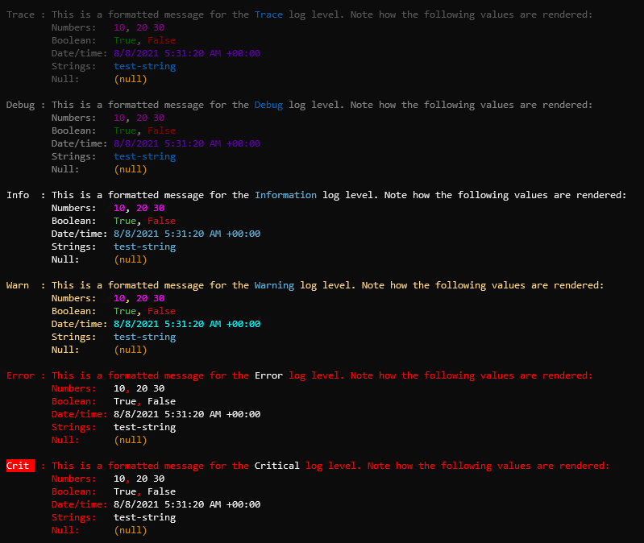

# Message template renderer

### Overview

Renders the log event message with structured log values substituted in the output.

```
Template: {Message}
```

### Options

> 💡 Note
>
> Renderer names and options within the template are case-sensitive.

Rendering is further controlled by the `MessageTemplateRenderer.Options` type. The following properties are available:

|Property|Description|
|---|---|
|`TypeStyles`|A dictionary of markup styles that are associated to specific types. The renderer evaluates the type of value being rendered and looks for a style in this dictionary. If found, the markup is applied before the value is rendered and the tag is closed afterward.|
|`DefaultTypeStyle`|A single markup style used as a fallback for all values rendered whose types are not located in the `TypeSyles` dictionary.|
|`ValueStyles`|A dictionary of markup styles that are associated to specific values. The renderer evaluates the value being rendered and looks for a style in this dictionary. If found, the markup is applied before the value is rendered and the tag is closed afterward.|
|`TypeFormatters`|A dictionary of formatting functions that are associated to specific types. The renderer evaluates the type of value being rendered and looks for a formatting function in this dictionary. If found, the function provides the value to render.
|`DefaultTypeFormatter`|A formatting function used as a fallback for all values rendered whose types are not located in the `TypeFormatters` dictionary.

Instead of accessing the dictionaries directly, alternatively use the extension methods on the `FormattedLogValuesRenderer.Options` types to set formatters and styles as shown below:

|Extension Method|Description|
|---|---|
|`AddTypeFormatter(Type, Func<>)`|Adds a formatting function for the given type|
|`AddTypeFormatter(IEnumerable<Type>, Func<>)`|Adds a formatting function for the given types|
|`AddTypeFormatter<T>(Func<>)`|Adds a formatting function for the type identified by the generic parameter|
|`AddTypeStyle(Type, string)`|Adds a style for the given type|
|`AddTypeStyle(IEnumerable<Type>, string)`|Adds a style for the given types|
|`AddTypestyle<T>(string)`|Adds a style for the type identified by the generic parameter|
|`AddValueStyle<T>(T, string)`|Adds a style for a specific value|
|`AddValueStyle(IEnumerable<object>, string)`|Adds a style for the given specific values|
|`ClearTypeFormatters()`|Clears all type formatters|
|`ClearTypeStyles()`|Clears all type styles|
|`ClearValueStyles()`|Clears all value styles|

### Example

```csharp
var loggerFactory = LoggerFactory.Create(builder =>
{
    builder.AddSpectreConsole(options =>
    {
        options.MinimumLevel = LogLevel.Trace;
        options.ConfigureProfiles(profile => profile
            .AddTypeStyle<NullValue>(Color.Orange3.ToMarkup())
            .AddTypeFormatter<NullValue>(_ => "(null)")
            .OutputTemplate = "{LogLevel,-5} : {Margin:8}{Message}{Exception:NewLine?}");
    });
    builder.SetMinimumLevel(LogLevel.Trace);
});

var logLevels = new[] {LogLevel.Trace, LogLevel.Debug, LogLevel.Information, LogLevel.Warning, LogLevel.Error, LogLevel.Critical};

foreach (var logLevel in logLevels)
{
    Console.WriteLine();

    logger.Log(logLevel,
        "This is a formatted message for the {level} log level. Note how the following values are rendered:" + Environment.NewLine 
        + "Numbers:   {x}, {y} {z}" + Environment.NewLine
        + "Boolean:   {bool_true}, {bool_false}" + Environment.NewLine 
        + "Date/time: {date}" + Environment.NewLine
        + "Strings:   {string}" + Environment.NewLine
        + "Null:      {value}",
        logLevel.ToString(),
        10, 20, 30f,
        true, false,
        DateTimeOffset.UtcNow,
        "test-string",
        null);
}
```

Output

