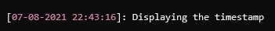

# Timestamp renderer

### Overview

Renders the time of the log event.

```
Template: {Timestamp[,width][:format]
```

### Options

> 💡 Note
>
> Renderer names and options within the template are case-sensitive.

|Template option|Description|
|---|---|
|`[,width]`|Used to align the output within a fixed width. Negative values align the text to the left; positive values align the text to the right.|
|`[:format]`|A composite formatting code supported by `string.Format` and the value type.

### Example

```csharp
var logger = LoggerFactory.Create(builder => builder.AddSpectreConsole(options =>
    {
        options.ConfigureProfile(LogLevel.Information, profile =>
        {
            profile.OutputTemplate = "[{Timestamp:dd-MM-yyyy HH:mm:ss}]: {Message}";
            profile.ConfigureRenderer<TimestampRenderer.Options>(opt =>
                opt.Style = Color.Pink3.ToMarkup());
        });
    }))
    .CreateLogger("Example");

logger.LogInformation("Displaying the timestamp");
```

Output:

